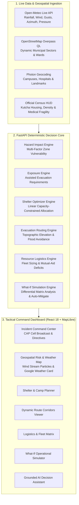

# 🌐 TERRALYNX (v2.0)
### Autonomous Geospatial Incident Command System & Disaster Operations Decision Platform

<div align="center">

[](https://www.python.org/)
[](https://fastapi.tiangolo.com)
[](https://reactjs.org/)
[](https://www.typescriptlang.org/)
[](https://vitejs.dev/)
[](https://tailwindcss.com/)
[](https://maplibre.org/)
[](https://pytest.org/)
[](LICENSE)

<p align="center">
  <b>Predict. Optimize. Mobilize. Protect.</b><br>
  <i>Transforming extreme hydrometeorological crisis response from reactive post-disaster relief into predictive, deterministic geospatial logistics and autonomous evacuation coordination.</i>
</p>

</div>

---

## 📖 Table of Contents
- [Executive Overview](#-executive-overview)
- [System Architecture](#-system-architecture)
- [The 7 Core Modules](#-the-7-core-modules)
- [Mathematical Decision Models](#-mathematical-decision-models)
- [Emergency Fleet & Logistics Sizing](#-emergency-fleet--logistics-sizing)
- [Project Directory Structure](#-project-directory-structure)
- [Getting Started](#-getting-started)
- [REST API Specifications](#-rest-api-specifications)
- [Data Integrity & Engineering Principles](#-data-integrity--engineering-principles)

---

## ⚡ Executive Overview

Coastal and river delta regions in Eastern India—specifically **Odisha's Mahanadi Basin, Cuttack Millennium City, and Bhubaneswar**—face recurring Category 4/5 super cyclones, extreme cloudbursts ($>250\text{mm}/24\text{h}$), and low-elevation coastal storm surges.

**TERRALYNX** is an end-to-end incident command platform built to answer the primary operational question:
> **"Given current and predicted storm telemetry, what exact actions, fleets, routes, and shelter allocations must be authorized right now?"**

### The Core Operational Loop
```text
┌─────────────────────────┐     ┌────────────────────────┐     ┌────────────────────────┐
│   LIVE DATA INGESTION   │ ──► │  HAZARD & VULNERABILITY│ ──► │ ASSISTED EVACUATION    │
│ Open-Meteo, OSM, Census │     │     IMPACT ENGINE      │     │    DEMAND MODELING     │
└─────────────────────────┘     └────────────────────────┘     └────────────────────────┘
                                                                           │
                                                                           ▼
┌─────────────────────────┐     ┌────────────────────────┐     ┌────────────────────────┐
│  COMMAND-CENTER HUD &   │ ◄── │ RESOURCE FLEET SIZING  │ ◄── │  CAPACITY-CONSTRAINED  │
│  CELL BROADCAST (CAP)   │     │   & SHORTFALL MATRIX   │     │  SHELTER OPTIMIZATION  │
└─────────────────────────┘     └────────────────────────┘     └────────────────────────┘
             │                               
             ▼
┌─────────────────────────┐
│ WHAT-IF SIMULATOR WITH  │
│ AUTO-MITIGATION ENGINE  │
└─────────────────────────┘
```

---

## 🏛️ System Architecture



---

## 🧩 The 7 Core Modules

### 1. 🚨 Incident Command Center (ICS)
- **Live Threat Banner:** Real-time tracking of cyclone category, central barometric pressure, 24h rainfall totals, sustained winds, and landfall countdown.
- **CAP Emergency Cell Broadcast:** 1-click modal to transmit synthesized Common Alerting Protocol (CAP) messages to cell towers and siren networks across threatened sectors.
- **Prioritized Action Directives:** Ranked tactical directives with assigned tactical agency badges (`ODRAF Unit 4`, `NDRF 3rd Bn`, `District Traffic Police`) and **1-Click Bulk Authorization**.
- **Critical Infrastructure Matrix:** Live monitoring of apex hospitals (*SCB Medical College*, *AIIMS Bhubaneswar*) and flood-threatened road segments.

### 2. 🗺️ High-Precision Geospatial Risk & Weather Map
- **Dynamic OSM Municipal Sectors:** Eliminates static boundaries by querying live OpenStreetMap sectors (*CDA Sector 9, Sector 6, Sector 10, Bidanasi, Chauliaganj*).
- **Google Weather Card & Point Telemetry:** Inspect any clicked point or searched location to view live temperature, humidity, precipitation probability, and **rotating wind direction compass arrows (azimuth + degrees)**.
- **24-Hour Forecast Timeline:** Interactive timeline tabs for Temperature ($^\circ\text{C} / ^\circ\text{F}$), Precipitation ($\%$, $\text{mm}$), and Wind ($\text{km/h}$).
- **Global Search with Keyboard Navigation:** Multi-tier fuzzy search with smooth camera `flyTo` for campuses (*C. V. Raman Global University*), hospitals, and sectors.
- **GPU-Accelerated Wind Stream Particles:** NullSchool-style canvas stream particle physics layer.
- **Official Census HUD:** Official demographics modal displaying rural/urban ratios, literacy rates, and kutcha housing exposure.

### 3. 🏛️ Shelter Optimization & Temporary Camp Planner
- **Linear Distance & Safety Optimizer:** Assigns evacuees to verified cyclone shelters while strictly preventing overcrowding:
  $$\text{Cost}(z, s) = \text{HaversineDistance}(z, s) + 0.10 \cdot (100 - \text{SafetyScore}(s)) - 0.20 \cdot \max(0, \text{Elevation}(s) - 5.0\text{m})$$
- **Contingency Complex Activation:** Automatically identifies and queues high-capacity temporary facilities (university convention centers, indoor sports stadiums) when designated shelters exceed $80\%$ capacity.

### 4. 🛣️ Evacuation Routing & Cutoff Prediction
- **Hydraulic Road Vulnerability:** Evaluates road segments against predicted storm surge and heavy runoff.
- **Cutoff Prediction Timers:** Computes countdowns before low-lying road corridors become impassable.
- **Dynamic Bypass Routing:** Re-routes evacuation convoys through elevated arterial highways.

### 5. 🚚 Emergency Fleet & Resource Logistics Matrix
- **Supply Chain Health Dashboard:** 4 live KPI cards for **Fleet Mobility**, **Water Rescue**, **Tactical Search & Rescue**, and **72h Sustenance Rations**.
- **Interactive Mutual-Aid Requisition Console:** 1-click modal to mobilize reserve fleets ($+5$, $+15$, or custom units) to instantly clear logistical deficits.
- **Category Filter Tabs:** Quickly filter assets across `All`, `⚠️ Deficits Only`, `Fleets`, `Medical & Triage`, and `Supplies & Power`.

### 6. 🧪 What-If Operational Scenario Simulator
- **Interactive Sliders:** Live control over Precipitation ($0.5\times$ to $2.2\times$), Cyclone Wind Force (Cat 1 to Cat 5), Coastal Storm Surge ($0.5\text{m}$ to $4.5\text{m}$), and Fleet Availability.
- **Pre-Engineered Presets:** *Cat-5 Super Cyclone Escalation*, *Delta Cloudburst (+80% rain)*, *Bridge Washouts*, and *Shelter Outages*.
- **✨ One-Click "Auto-Mitigate All Deficits":** Instantly provisions mutual-aid fleets and activates temporary emergency complexes to eliminate all shortfalls and overflow.
- **Differential Impact Visualizer:** Side-by-side delta cards comparing baseline vs. simulated values with color-coded trend indicators.

### 7. 🤖 Grounded AI Decision Assistant
- **Deterministic Natural-Language Briefings:** Ingests live simulation state data to answer complex tactical questions without hallucinations.

---

## 📐 Mathematical Decision Models

### 1. Zone Risk Index $R(z) \in [0, 100]$
Combines 5 physical and vulnerability metrics into a unified risk rating:
$$R(z) = 0.28 \cdot \min\left(100, \frac{P_{24h}}{3.0}\right) + 0.22 \cdot \min\left(100, \frac{W_{\text{gusts}}}{2.0}\right) + 0.20 \cdot \min\left(100, S_{\text{surge}} \cdot 25\right) + 0.18 \cdot \max\left(0, 100 - E_{\text{elev}} \cdot 10\right) + 0.12 \cdot K_{\text{kutcha}}$$

### 2. Assisted Evacuation Demand $E(z)$
Calculates the exact assisted transit requirement for each sector:
$$E(z) = \text{Population}(z) \times \text{ExposureMultiplier}(R(z)) \times \left(0.40 \cdot \frac{K_{\text{kutcha}}}{100} + 0.35 \cdot \text{ElderlyRatio} + 0.25 \cdot \text{FloodThreatIndex}\right)$$

---

## 🚚 Emergency Fleet & Logistics Sizing

| Asset Class | Sizing Equation | Operational Rationale |
|---|---|---|
| **40-pax Evacuation Buses** | $\lceil (E_{\text{total}} \times 0.80) / (40 \times 1.5) \rceil$ | Assumes $80\%$ transit dependence & $1.5$ convoy turnaround cycles |
| **Inflatable Rescue Boats & OBMs** | $4 \times N_{\text{delta zones}} + 2 \times N_{\text{critical zones}}$ | Allocated to low-elevation waterlogged zones ($\le 3.5\text{m}$) |
| **ALS Ambulances** | $\lceil \text{MedicalDependencies} / 18 \rceil + N_{\text{hospitals}}$ | Dedicated to ICU hospital transfers & registered fragile patients |
| **Tactical NDRF / ODRAF Teams** | $\lceil E_{\text{critical}} / 650 \rceil + N_{\text{critical zones}}$ | 10-person units deployed to high-risk structural breach zones |
| **72-Hour Sustenance Rations** | $E_{\text{total}} \times 3 \text{ days}$ | 72-hour survival food & potable water packs for active shelters |
| **Heavy Mobile Diesel Generators** | $N_{\text{active shelters}} \times 2$ | 25kVA generators to ensure continuous water pumping & lighting |
---

## 📂 Project Directory Structure

```text
TERRALYNX/
├── backend/
│   ├── app/
│   │   ├── api/
│   │   │   └── router.py                 # REST API endpoints & route handlers
│   │   ├── engine/                       # Deterministic Decision Core
│   │   │   ├── alert_generator.py        # Operational alert synthesis
│   │   │   ├── exposure.py               # Evacuation demand calculation
│   │   │   ├── hazard_impact.py          # Multi-factor zone risk scoring
│   │   │   ├── resource_planner.py       # Emergency fleet & logistics sizing
│   │   │   ├── routing.py                # Topographic road flood assessment
│   │   │   └── shelter_optimizer.py      # Capacity-constrained shelter allocation
│   │   ├── models/                       # Pydantic v2 schemas
│   │   │   ├── geography.py              # Zone, Coordinates, Topography
│   │   │   ├── hazard.py                 # HazardTelemetry models
│   │   │   ├── infrastructure.py         # Shelter, Hospital, RoadSegment
│   │   │   ├── response.py               # Allocation, Route, Resource, Alert
│   │   │   └── scenario.py               # DistrictState, Overrides, Diff
│   │   ├── services/                     # Geospatial & Weather Integration
│   │   │   ├── ai_assistant.py           # Grounded AI decision service
│   │   │   ├── census_service.py         # Official Census demographics
│   │   │   ├── dynamic_district_generator.py # OSM Overpass boundary generator
│   │   │   ├── scenario_service.py       # Scenario orchestration & diff
│   │   │   ├── search_service.py         # Multi-tier fuzzy location search
│   │   │   └── weather_service.py        # Open-Meteo live API integration
│   │   ├── config.py                     # App settings & environment
│   │   └── main.py                       # FastAPI application entrypoint
│   └── tests/                            # Pytest Test Suite (15/15 passing)
│
├── frontend/
│   ├── src/
│   │   ├── components/
│   │   │   ├── ai_assistant/             # DecisionAssistant.tsx
│   │   │   ├── command_center/           # CommandCenterView, ThreatBanner, PriorityActionsList
│   │   │   ├── layout/                   # Header, Navigation
│   │   │   ├── map/                      # RiskMap, GoogleWeatherCard, LocationSearchBar, DemographicsCard
│   │   │   ├── resources/                # ResourcePlannerTable.tsx
│   │   │   ├── routing/                  # EvacuationRouteViewer.tsx
│   │   │   ├── shelter/                  # SheltersView, ShelterMatrix, TemporaryShelterPlanner
│   │   │   └── simulator/                # WhatIfSimulator.tsx
│   │   ├── services/                     # api.ts (Backend REST connector)
│   │   ├── types/                        # index.ts (Full TypeScript contracts)
│   │   ├── App.tsx                       # Master Application Root
│   │   └── main.tsx                      # Vite React entrypoint
│   └── package.json
│
├── TERRALYNX_Documentation.pdf           # Official 7-page technical PDF documentation
├── TERRALYNX_Documentation.html          # HTML printable technical documentation
└── README.md
```

---

## 🚀 Getting Started

### Prerequisites
- **Python:** 3.11 or 3.13
- **Node.js:** v18+ and `npm`

### 1. Start the FastAPI Backend
```powershell
# In the root TERRALYNX repository directory:
$env:PYTHONPATH="."
python -m uvicorn backend.app.main:app --host 0.0.0.0 --port 8000 --reload
```
* Interactive Swagger API Docs: **`http://localhost:8000/docs`**

### 2. Start the Vite Frontend Server
```powershell
cd frontend
npm install
npm run dev
```
* Local Web Dashboard: **`http://localhost:5173`** *(or `http://localhost:5174`)*

### 3. Run the Automated Test Suite
```powershell
$env:PYTHONPATH="."
pytest backend/tests -v
```
```text
======================= 15 passed in 21.24s =======================
```

---

## 🌐 REST API Specifications

| Endpoint | Method | Input Parameters | Description |
|---|---|---|---|
| `/api/scenario/current` | `GET` | None | Returns the full current operational district state |
| `/api/scenario/simulate` | `POST` | `SimulationOverrides` (JSON) | Recalculates response plan with before/after differential analysis |
| `/api/scenario/reset` | `POST` | None | Resets all simulation overrides to nominal baseline |
| `/api/location/search` | `GET` | `query` (string) | Fuzzy search for universities, hospitals, sectors, and cities |
| `/api/telemetry/point` | `GET` | `lat`, `lng`, `location_name` | Fetches live Open-Meteo weather with wind azimuth & 24h timeline |
| `/api/ai/query` | `POST` | `AIQueryRequest` (JSON) | Generates grounded natural-language disaster intelligence briefings |
| `/api/census/official` | `GET` | `district_name` (optional) | Retrieves official Government Census demographics profile |

---

## 🛡️ Data Integrity & Engineering Principles

1. **Deterministic Execution:** Decision calculations are 100% deterministic, mathematically explainable, and independently testable.
2. **Zero Fabricated Boundaries:** All geographic sectors (*CDA Sector 9, Bidanasi, etc.*) are queried directly from real OpenStreetMap Overpass geometries.
3. **Hard Capacity Constraints:** Shelter allocations strictly respect maximum shelter capacity thresholds without silent overflows.
4. **Live Telemetry Separation:** Telemetry feeds (Open-Meteo) are treated as data providers, distinct from calculated decision states.
5. **Strict Typing:** TypeScript models on the frontend strictly mirror Python Pydantic schemas on the backend.

---

<div align="center">
  <sub>Built for Resilience • <b>TERRALYNX Disaster Operations Platform</b></sub>
</div>
